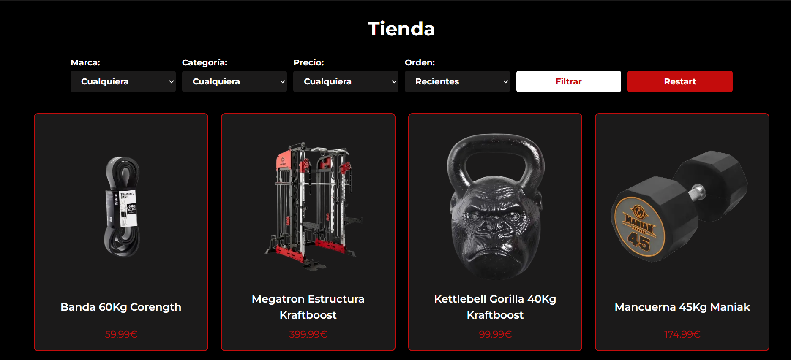
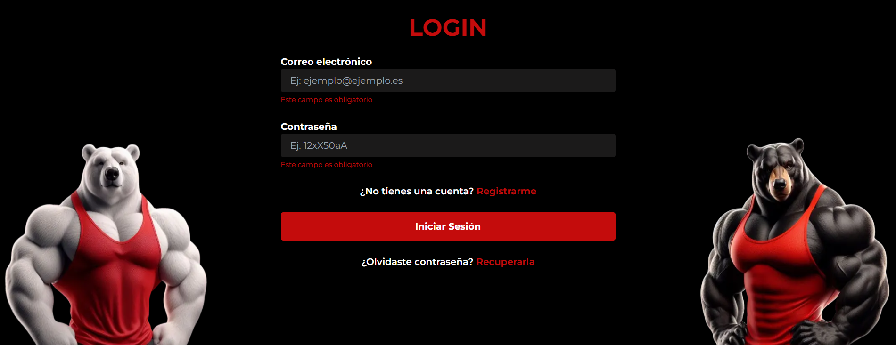
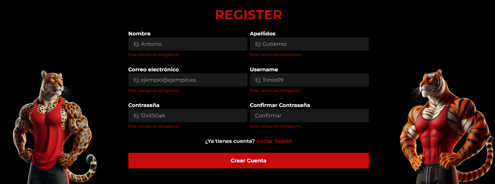
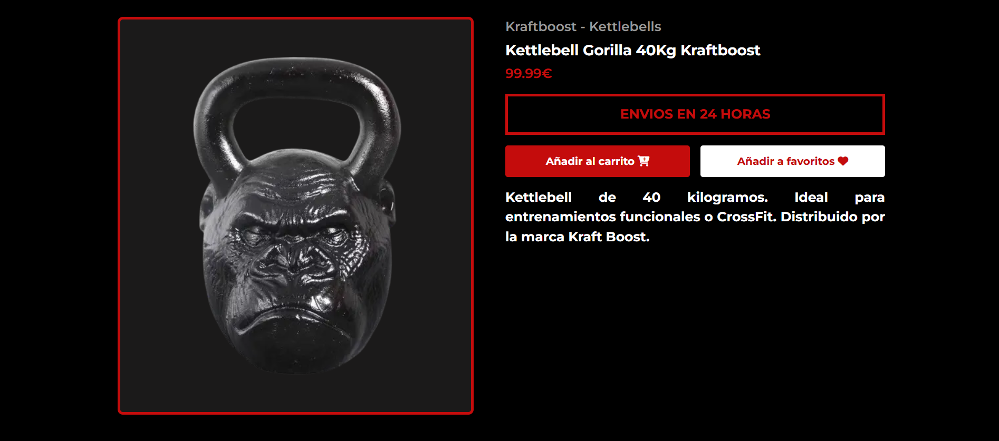
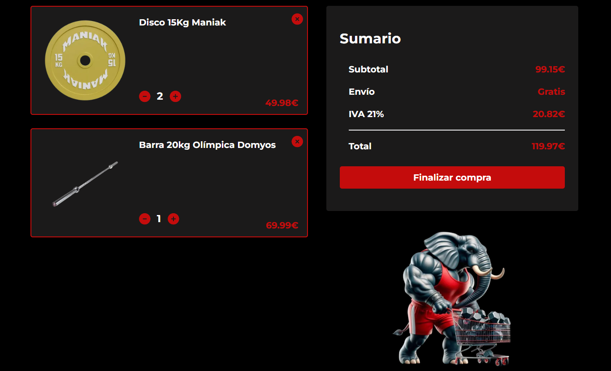
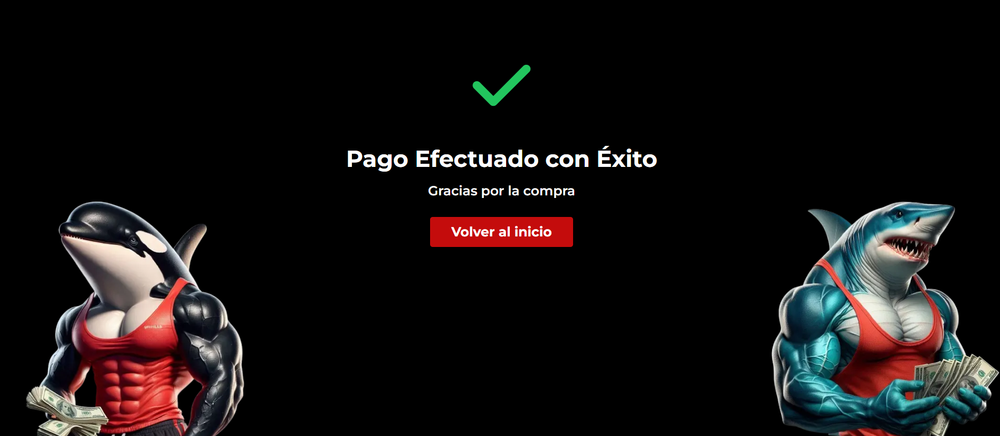
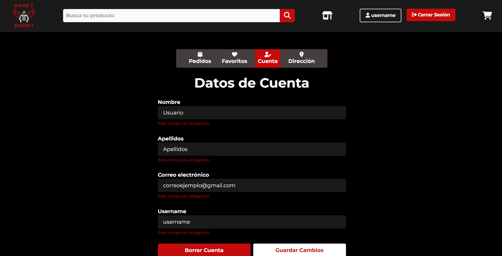
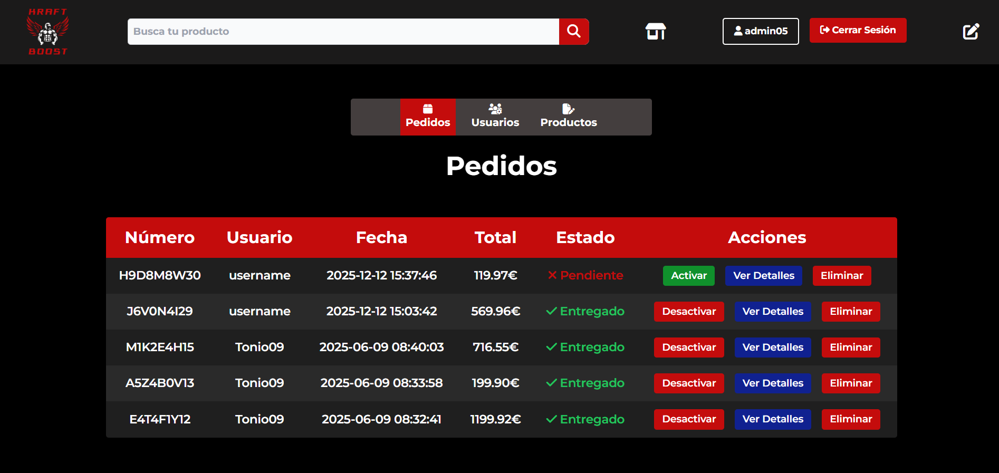
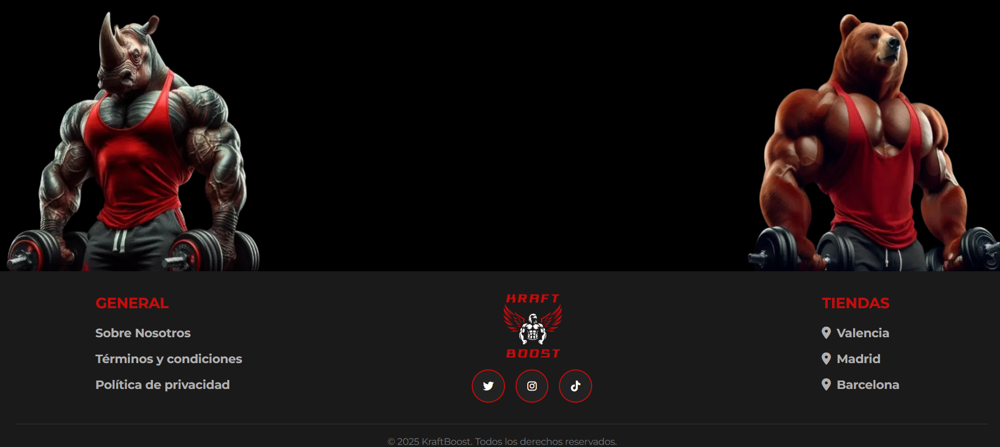

# KRAFTBOOST

Esta es una tienda online especializada en **pesas, mancuernas y equipamiento para el entrenamiento de fuerza**, diseñada para ofrecer una experiencia de compra fluida, completa y segura tanto para usuarios como para administradores.


# 📸 Capturas de pantalla

<details>
<summary><strong>📂 Mostrar / Ocultar capturas</strong></summary>

<br>

### **INICIO**


### **TIENDA**


### **LOGIN**


### **REGISTER**


### **PRODUCTO**


### **CARRITO**


### **COMPRA EXITOSA**


### **PEDIDO**


### **PERFIL USUARIO**


### **PERFIL ADMIN**


### **404**


### **401**


### **FOOTER**


</details>


### Funcionalidades para el Usuario:

- **Autenticación completa**: registro, login y recuperación de contraseña por email.
- **Exploración de productos** con buscador inteligente y filtros por categoría, marca, precio y orden.
- **Carrito de compras** con sistema de pasarela de pago, ficticio, pero funcional.
- **Envío de Emails** Mensajes de bienvenida, confirmación de pedidos, recuperación de contraseña, etc.
- **Gestión de perfil**: edición de datos personales, direcciones, favoritos y visualización del historial de pedidos con sus respectivos detalles y estado de envío.
- **Diseño intuitivo**, responsivo y enfocado en una experiencia de usuario amigable y eficiente.
- **Brevo**. Para el envío de correos utilizamos una API que maneja los correos por nosotros, evitando tener que usar manualmente smtplib y exponerse a restricciones impuestas por plataformas de despliegue como Render.


### Panel de Administración:

- **Gestión de pedidos**: ver, activar/desactivar y actualizar su estado.
- **Control de usuarios**: editar información o eliminar cuentas.
- **Gestión de productos**: editar, dar de baja o activar productos con total control.
- **Interfaz segura**, protegida y separada de las funciones de usuario normal.

### Extras Técnicos:

- Control de errores personalizado con páginas para códigos **401 (no autorizado)** y **404 (página no encontrada)**.
- Sistema de envío de **emails automáticos** para distintas acciones.
- Uso de **tokens**, **cookies** y **CSRF** para proteger algunas rutas como la recuperación de contraseña o pasarela de pago y formularios varios.
- Estructura modular con Blueprints de Flask para mantener el proyecto organizado y escalable.

En resumen, esta tienda online no solo permite comprar artículos deportivos de manera sencilla, sino que también ofrece un backend robusto y potente para una administración total del sistema.

---

## Requisitos

Para ejecutar este proyecto, necesitas:

- **Python 3.x**
- **MySQL** (puede ser local o en la nube)
#### 📚 Lista completa de dependencias

| Librería | Versión | Descripción breve |
|-----------|----------|------------------|
| **blinker** | 1.9.0 | Señales y eventos para aplicaciones Flask. |
| **certifi** | 2025.10.5 | Certificados SSL actualizados para peticiones seguras. |
| **click** | 8.1.8 | Utilidades para crear interfaces de línea de comandos. |
| **colorama** | 0.4.6 | Colores y estilos para la consola (Windows/Linux). |
| **dnspython** | 2.7.0 | Soporte DNS para validaciones y correos. |
| **email-validator** | 2.2.0 | Validación de direcciones de correo electrónico. |
| **Flask** | 3.1.0 | Framework web ligero en Python. |
| **Flask-Login** | 0.6.3 | Manejo de sesiones y autenticación de usuarios en Flask. |
| **Flask-Mail** | 0.10.0 | Envío de correos electrónicos desde Flask. |
| **Flask-MySQLdb** | 2.0.0 | Conector MySQL para Flask. |
| **Flask-WTF** | 1.2.2 | Integración de formularios WTForms con Flask. |
| **gunicorn** | 23.0.0 | Servidor WSGI para entornos de producción. |
| **idna** | 3.10 | Manejo de dominios internacionales (IDN). |
| **itsdangerous** | 2.2.0 | Firmado seguro de datos (tokens, cookies, etc.). |
| **Jinja2** | 3.1.6 | Motor de plantillas utilizado por Flask. |
| **MarkupSafe** | 3.0.2 | Previene la inyección de código en plantillas. |
| **mysqlclient** | 2.2.7 | Driver MySQL para Python. |
| **packaging** | 25.0 | Herramientas para gestionar versiones y dependencias. |
| **PyJWT** | 2.10.1 | Implementación de JSON Web Tokens (JWT). |
| **python-dateutil** | 2.9.0.post0 | Extensiones para manejo de fechas y tiempos. |
| **python-dotenv** | 1.1.0 | Carga variables de entorno desde un archivo `.env`. |
| **sib-api-v3-sdk** | 7.6.0 | SDK oficial de **Sendinblue / Brevo** para envío de correos. |
| **six** | 1.17.0 | Compatibilidad entre Python 2 y 3. |
| **Unidecode** | 1.4.0 | Conversión de caracteres Unicode a ASCII. |
| **urllib3** | 2.5.0 | Cliente HTTP potente y confiable. |
| **Werkzeug** | 3.1.3 | Utilidades WSGI utilizadas internamente por Flask. |
| **WTForms** | 3.2.1 | Librería de formularios flexible y validaciones. |

## Instalación

1. **Clona el repositorio**  
   Ejecuta el siguiente comando en tu terminal:
   ```bash
   git https://github.com/DavidKal29/Proyecto-Final-TFG.git
   cd Proyecto-Final-TFG

2. **Crea un entorno virtual** (opcional pero recomendado):
   ```bash
   python -m venv env
   source env/bin/activate    # Linux/Mac
   env\Scripts\activate       # Windows

3. **Instala las dependencias** 
   ```bash
   pip install -r requeriments.txt

4. **Configura las variables de entorno** 
   Crea un archivo .env y pon las siguientes variables, poniendo obviamente tus propios datos:
   ```env
      SECRET_KEY=
      MYSQL_HOST=
      MYSQL_USER=
      MYSQL_PASSWORD=
      MYSQL_DB=
      MYSQL_HOST_CLEVER_CLOUD=
      MYSQL_USER_CLEVER_CLOUD=
      MYSQL_PASSWORD_CLEVER_CLOUD=
      MYSQL_DB_CLEVER_CLOUD=
      CORREO=
      BREVO_API_KEY= (Asegurate de tener cuenta en Brevo y tener la apikey válida)
      JWT_SECRET_KEY_RESET_PASSWORD=
      JWT_SECRET_KEY_RESET_CART=

5. **Ejectua la aplicacion** 
   ```bash
    python src/app.py 

6. **Abre el navegador** 
   Ve a http://127.0.0.1:5000 para acceder a la aplicación.